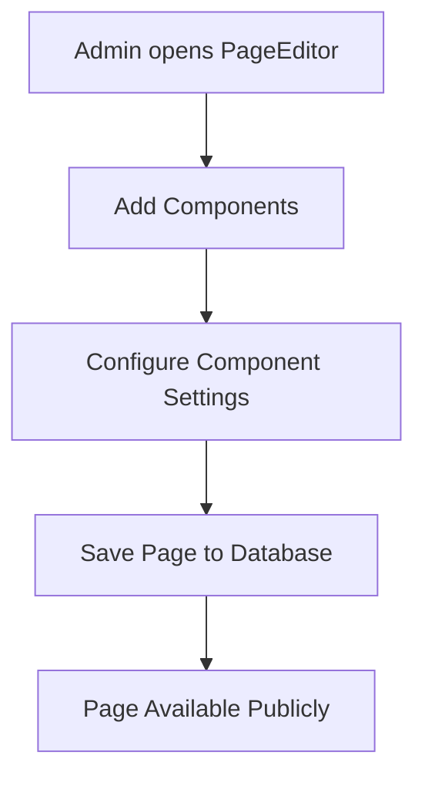

# Page Builder System Documentation

## Overview

The Page Builder system allows administrators to create dynamic pages with customizable components and view them on the public website. The system consists of a drag-and-drop page editor, component settings management, and dynamic public page rendering.

## Architecture

### Core Components

1. **Page Editor (Admin)** - Create and manage pages with components
2. **Component Settings** - Configure individual component properties
3. **Public Page Renderer** - Display pages to public users
4. **Database Storage** - Store page structure and component settings

## File Structure

### Frontend Components

#### Admin Panel
- `resources/js/pages/PageEditor.vue` - Main page builder interface
- `resources/js/pages/PageEditorSimple.vue` - Simplified page editor
- `resources/js/layouts/DefaultLayout.vue` - Admin layout wrapper

#### Public Pages
- `resources/js/pages/PublicPage.vue` - Dynamic page renderer for public
- `resources/js/pages/University.vue` - University homepage
- `resources/js/layouts/PublicLayout.vue` - Public layout wrapper

#### User Components
- `resources/js/components/user/HeadlineMarquee.vue` - Scrolling headlines component
- `resources/js/components/user/HeroCarousel.vue` - Image carousel component
- `resources/js/components/user/MessageFrom.vue` - Message display component

### Backend Files

#### Routes
- `routes/web.php` - Contains all page-related API routes:
  - `POST /api/pages` - Create new page
  - `PUT /api/pages/{id}` - Update existing page
  - `GET /api/pages/{id}` - Get page data
  - `GET /{slug}` - Dynamic public page route

#### Models
- `app/Models/Page.php` - Page model for database operations

#### Database
- `database/migrations/create_pages_table.php` - Page table structure

## How It Works

### 1. Page Creation Flow



#### Step-by-Step Process:

1. **Admin Access**: Administrator navigates to `/admin/pages/create` or `/admin/pages/edit/{id}`
2. **Component Library**: Available components are displayed in a sidebar
3. **Drag & Drop**: Admin drags components to the page canvas
4. **Component Settings**: Click settings icon to configure component properties
5. **Save Page**: Page structure and settings saved to database as JSON

### 2. Component Settings System

Each component can have custom settings stored in the database:

```json
{
  "components": [
    {
      "id": "HeadlineMarquee-1234567890",
      "type": "HeadlineMarquee",
      "order": 0
    }
  ],
  "componentSettings": {
    "HeadlineMarquee-1234567890": {
      "headlines": [
        {
          "id": 1,
          "type": "announcement",
          "text": "Custom headline text",
          "link": "https://example.com",
          "priority": "high"
        }
      ]
    }
  }
}
```

### 3. Public Page Rendering

```mermaid
graph TD
    A[User visits /{slug}] --> B[Route Handler]
    B --> C[Load Page from Database]
    C --> D[Parse Components & Settings]
    D --> E[Render PublicPage.vue]
    E --> F[Display Components with Custom Data]
```

#### Rendering Process:

1. **Route Matching**: Dynamic route `/{slug}` catches page requests
2. **Database Query**: Page data loaded by slug from `pages` table
3. **Content Parsing**: JSON content parsed to extract components and settings
4. **Data Passing**: Component settings passed to Vue components via props
5. **Component Rendering**: Each component receives its custom configuration

### 4. Data Flow

#### Admin Panel Data Flow:
```
PageEditor → Component Settings Modal → componentSettings (ref) → API Call → Database
```

#### Public Page Data Flow:
```
Database → Route Handler → PublicPage Props → getComponentData() → Component Props
```

## Key Features

### 1. Dynamic Component Loading
- Components are loaded dynamically based on database configuration
- Each component receives custom settings via props
- Fallback to default settings if no custom configuration exists

### 2. Real-time Preview
- Admin panel shows live preview of components
- Settings changes immediately reflected in preview
- WYSIWYG editing experience

### 3. Component Settings Management
- Modal-based settings interface
- Form validation and error handling
- Loading states and user feedback

### 4. Responsive Design
- All components are mobile-responsive
- Admin panel works on different screen sizes
- Public pages optimized for all devices

## Database Schema

### Pages Table
```sql
CREATE TABLE pages (
    id BIGINT PRIMARY KEY,
    name VARCHAR(255) NOT NULL,
    slug VARCHAR(255) UNIQUE NOT NULL,
    description TEXT,
    content JSON, -- Contains components and componentSettings
    site_id BIGINT,
    created_at TIMESTAMP,
    updated_at TIMESTAMP
);
```

### Content JSON Structure
```json
{
  "components": [
    {
      "id": "unique-component-id",
      "type": "ComponentName",
      "order": 0
    }
  ],
  "componentSettings": {
    "unique-component-id": {
      "property1": "value1",
      "property2": "value2"
    }
  }
}
```

## API Endpoints

### Page Management
- `POST /api/pages` - Create new page
- `PUT /api/pages/{id}` - Update page
- `GET /api/pages/{id}` - Get page data

### Public Access
- `GET /{slug}` - View public page

## Component Development

### Creating New Components

1. **Create Component File**: Add to `resources/js/components/user/`
2. **Register in Library**: Add to `componentLibrary` in PageEditor
3. **Add Settings Form**: Create settings interface in PageEditor modal
4. **Handle Props**: Accept `component-data` prop with settings

### Component Props Structure
```typescript
interface ComponentData {
  id: string;
  type: string;
  order: number;
  // Custom settings merged here
  [key: string]: any;
}
```

## Troubleshooting

### Common Issues

1. **Component Not Rendering**: Check if component is registered in `componentLibrary`
2. **Settings Not Saving**: Verify API endpoint and CSRF token
3. **Public Page 404**: Ensure slug exists in database and route is configured
4. **Settings Not Loading**: Check JSON structure in database content field

### Debug Tools

- Browser console logs show component loading status
- Server logs track API requests and database operations
- Vue DevTools for component state inspection

## Future Enhancements

1. **Component Marketplace**: Plugin system for third-party components
2. **Template System**: Pre-built page templates
3. **Version Control**: Page revision history
4. **Multi-site Support**: Manage multiple websites
5. **Advanced Permissions**: Role-based component access
6. **SEO Tools**: Meta tags and schema markup management

## Security Considerations

1. **CSRF Protection**: All API calls include CSRF tokens
2. **Input Validation**: Server-side validation for all data
3. **XSS Prevention**: Proper data sanitization
4. **Access Control**: Admin-only access to page editor
5. **SQL Injection**: Using Laravel's query builder and ORM

## Performance Optimization

1. **Lazy Loading**: Components loaded on demand
2. **Caching**: Page content cached for public access
3. **Asset Optimization**: CSS/JS minification and compression
4. **Database Indexing**: Optimized queries with proper indexes
5. **CDN Integration**: Static assets served from CDN
